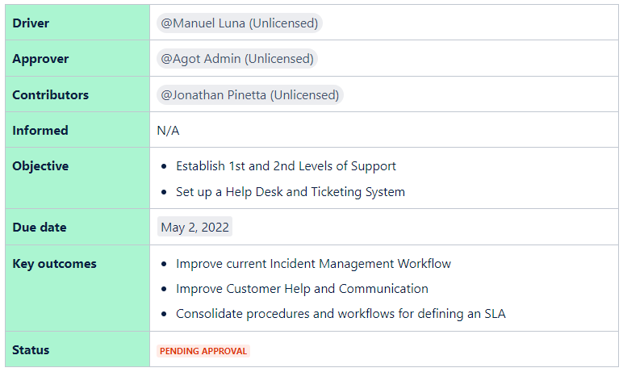
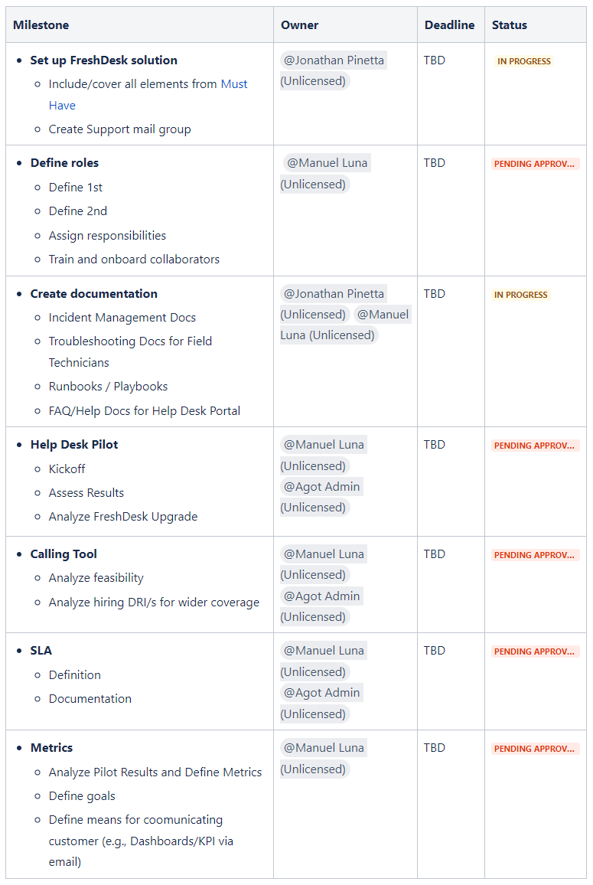

Knowledge Base
Support Docs
Project Docs
Technical Documentation
English

> **About this project...**  
🥑 I worked for this American company that came up with this cutting-edge **Computer Vision and AI model** for recognizing patterns within fast-food chains' kitchens to predict and prevent issues, thus improving processes and quality while cutting expenses. They caught the eyes of industry titans such as **McDonalds**, **KFC**, and **Taco Bell**. Back then, their business model appeared solid, and their team was constituted of at most sixty people, from devs to field technicians.  🔥 Since they were concentrating on (and still running) MVPs and PoCs, they faced a common issue numerous startups share: **no Documentation Culture**. Nearly every process and task was carried out without being properly documented, from technical specifications to post-mortems, from user stories to customer-facing product docs, from incident tickets to troubleshooting and support handbooks. I took on the role of their **Tech Writer**. The CEO himself assigned me the vital task of consolidating and converging all internal documentation into a robust (and nice-looking) **Knowledge Base**. While I was still getting used to their operation, projects' specifics, and teams' dynamics, I noticed there was a vital gear missing in the whole mechanism: They did not have a **Service Desk Portal** for the customers to report incidents (Every single issue was reported via email or over a direct phone line).   🚀 Lucky me, I had already been in a company that went through a similar situation. This allowed me to come up with a solution. I designed an **Incident Management Process** layout for their **Support Agents**, to implement in conjunction with a **Help Desk Solution** where their Customers could report issues and request assistance, and a series of **FAQ** inputs and **Help Articles** for their Field Technicians to consult. The following document was intended to be the project's specification cover, which I used as a cue for my presentation.
 

# DoxHut's HelpDesk Project

## In this Document
- Problem Statement
- Scope
- Timeline
- Milestones and deadlines
- Reference materials

## Project Info

## Problem Statement
Currently, there is no 1st or 2nd level Support at DoxHut that we can provide to our customers nor an established or defined process our customers must follow to receive the necessary help when facing technical issues or assistance requests.

## Scope

## Timeline

## Milestones and deadlines

## Reference Material
- Incident Management Project
- Incident Management Handbook
- Runbooks
- FreshDesk Implementation Blueprint
- FreshDesk Documentation
- Helpdesk - Customer Portal

[Back](./)
