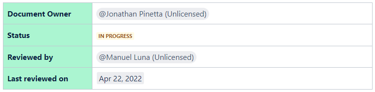

## Use Case

asd

## Field Technicians Troubleshooting

### Goal

This document aims to provide **Field Technicians** with a comprehensive overview of common issues and practical guidelines on how to effectively address them. It covers a wide range of scenarios, including remote troubleshooting and on-site analysis, offering actionable steps for resolution.

> 💡 Contact **SRE's Team Leader** for further questions via Slack. 
> 📡 Is there anything missing? Reach out to our **Tech Writer** via Slack.

### On this Page

- [In-Store Monitoring Service](#in-store-monitoring-service)
  - [Connection Issue](#connection-issue)
  - [VPN is Down](#vpn-is-down)
- [NAS](#nas)
  - [NAS is Full](#nas-is-full)
  - [NAS Disconnected](#nas-disconnected)
  - [NAS Disk Broken](#nas-disk-broken)
- [Router](#router)
  - [Router is Broken](#router-is-broken)
  - [K3s Stopped](#k3s-stopped)
  - [LTE/Dongle Issue](#ltedongle-issue)
- [Server](#server)
  - [Internal Disc Full](#internal-disc-full)
  - [Excessive CPU Use Alert](#excessive-cpu-use-alert)
  - [High-Temperature Alarm](#high-temperature-alarm)
  - ["The Box is Disconnected" Message](#the-box-is-disconnected-message)
  - [Server not Recording](#server-not-recording)
  - [NAS is not Mounted](#nas-is-not-mounted)
  - [Wrong Time Settings](#wrong-time-settings)
  - [Excessive RAM Use](#excessive-ram-use)
- [Smart Power Supply](#smart-power-supply)
  - [Power Switch Unreachable (Not Shown/ No Message)](#power-switch-unreachable-not-shown-no-message)
  - [Outlets are Blocked (No Message)](#outlets-are-blocked-no-message)
- [Switch](#switch)
  - [Switch is Off](#switch-is-off)
  - [Server Issue / Server is Off](#server-issue--server-is-off)

## In-Store Monitoring Service
### Connection Issue

### VPN is Down

## NAS
### NAS is Full

### NAS Disconnected

### NAS Disk Broken

## Router
### Router is Broken

### K3s Stopped 

### LTE/Dongle Issue

## Server
### Internal Disc Full

### Excessive CPU Use Alert

### High-Temperature Alarm

### "The Box is Disconnected" Message

### Server not Recording

### NAS is not Mounted

### Wrong Time Settings

### Excessive RAM Use

## Smart Power Supply
### Power Switch Unreachable (Not Shown/ No Message)

### Outlets are Blocked (No Message)

## Switch
### Switch is Off

### Server Issue / Server is Off

[Back](./)
