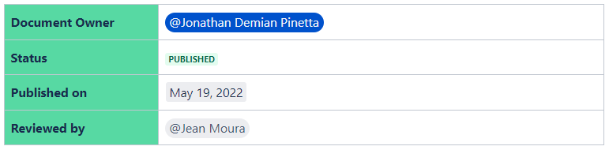

## Actions Required

- Create Passwords and Sections for Servers on LastPass
- Access Servers and Change Routers Passwords
- Add SREs SSH RSA Keys to the Routers Authorized Keys
- Set Server Time

## Prerequisites

- Having a LastPass user
- Having a Teleport User
- Having Teleport installed
- Having Necessary SSH RSA Keys
- Knowing which Servers to make changes on.

## Creating Passwords for Stores' Routers on LastPass

To create a section for each store’s router password on LastPass:

1. Access Agot’s LastPass Password Manager panel.
2. Create a New Item by clicking the plus sign located at the bottom right corner.

